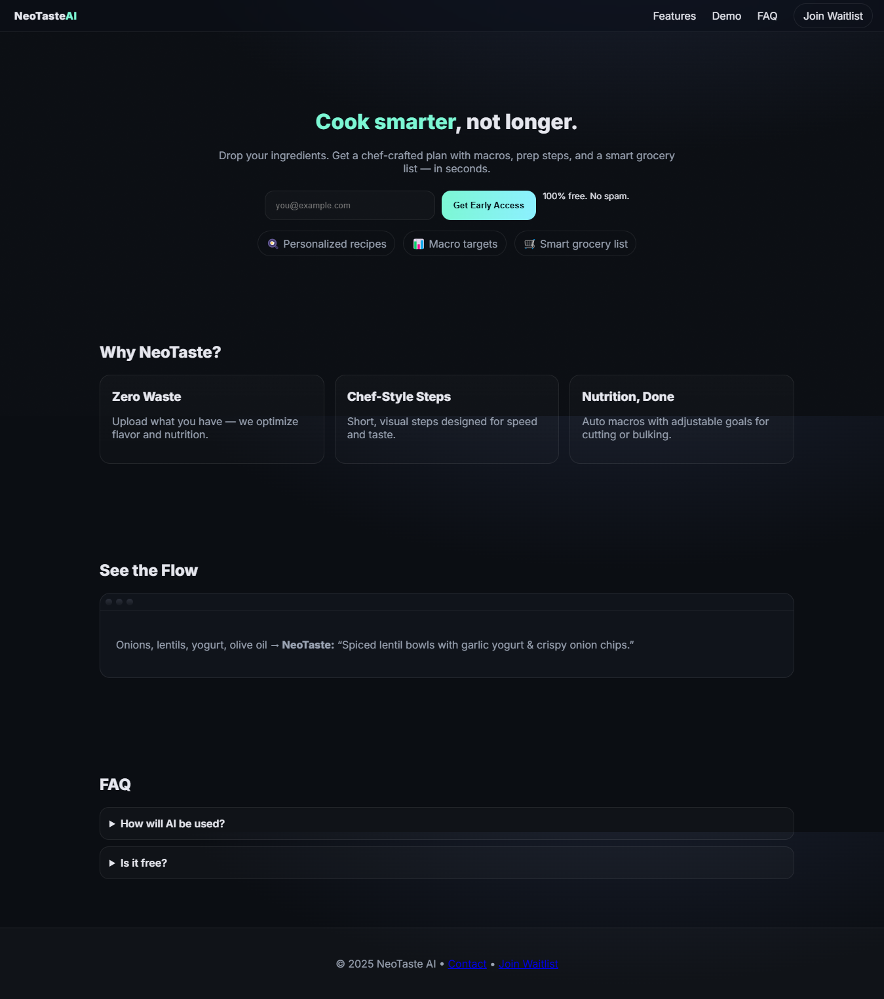

# NeoTaste AI – Cook Smarter

Turn leftovers into 5-star meals with NeoTaste AI. Get personalized recipes, macro targets, and smart grocery lists in seconds.

## 🌐 Live Demo

[View Live Site](https://github.com/ahmedbernawi/neotaste-ai)

## Screenshot



## Features

- 🍳 Personalized recipes based on your ingredients
- 📊 Macro targets for nutrition goals
- 🛒 Smart grocery list generation
- Zero waste cooking
- Chef-style, visual prep steps

## Demo

See the flow in the [Demo](#demo) section of the site.

## Waitlist

Join the waitlist for early access!  
Submit your email on the homepage.

## Getting Started

1. Clone the repository:
   ```sh
   git clone https://github.com/ahmedbernawi/neotaste-ai.git
   ```
2. Open the folder in VS Code.
3. Run with [Live Server](https://marketplace.visualstudio.com/items?itemName=ritwickdey.LiveServer) or open `index.html` in your browser.

## File Structure

- `index.html` – Main landing page
- `styles.css` – Stylesheet
- `script.js` – JavaScript functionality

## Contact

Questions? Email [hello@neotaste.example](mailto:hello@neotaste.example)

---

© 2025 NeoTaste AI